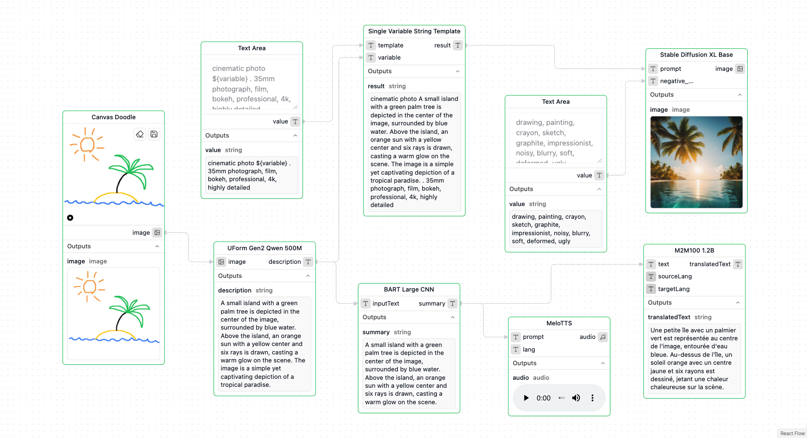

# Dafthunk

> Break it, fix it, prompt it, automatic, automatic, ...

A workflow execution platform built on top of the fantastic Cloudflare infrastructure.



## 🔍 Overview

[Daf·thunk](https://en.wikipedia.org/wiki/Thunk) is a powerful, visual workflow automation platform that allows you to create, manage, and execute workflows directly in your browser. Built on Cloudflare's infrastructure, it leverages Cloudflare Workers and Workflows for serverless execution, Cloudflare AI for intelligent processing, and Cloudflare D1, R2, and KV for persistent storage.

The platform features a visual workflow editor built with [React Flow](https://reactflow.dev/), allowing you to create complex workflows by connecting various node types, including AI-powered nodes for text processing, image classification, and more. Think digital LEGO, but with less risk to your bare feet at 2 AM.

## ✨ Features

- **Visual Workflow Editor**: A drag-and-drop interface for creating and editing workflows that makes command-line enthusiasts mildly uncomfortable.
- **AI-Powered Nodes**: Leverage Cloudflare AI for text summarization, sentiment analysis, translation, image classification, audio transcription, image generation, and more.
- **Serverless Execution**: Run workflows on Cloudflare's global network using Cloudflare Workers, where servers are merely a philosophical concept.
- **Live Monitoring**: Watch your workflows succeed, fail, or do something in between, all live with a UI or an API.
- **Persistent Storage**: Save and load execution data from Cloudflare D1 and R2 with reasonable confidence that they'll still be there tomorrow.
- **Triggers & Integrations**: Nothing happens unless something happens. So you can make it happen with HTTP APIs, emails, and more.

## 🛠️ Technology Stack

Our collection of carefully selected technologies, guaranteed to be outdated by the time you read this:

### Environment

- **pnpm** for fast and efficient package management with workspace support.
- **TypeScript** for static typing and enhanced developer experience.
- **Vitest** for unit and integration testing.
- **Cloudflare** for edge-optimized deployment and performance.

### Backend

- **Hono** for lightweight, expressive REST API development.
- **Cloudflare Workers** for serverless function execution.
- **Cloudflare D1** (SQLite) for database storage.
- **Cloudflare R2** for object storage.
- **Cloudflare AI** for AI model inference.
- **Drizzle ORM** for type-safe database operations.
- **Zod** for runtime type validation.

### Frontend

- **Vite** as the build tool and dev server for lightning-fast development.
- **React 19** for building interactive user interfaces.
- **React Router v7** for declarative client-side routing.
- **React Flow (@xyflow/react)** for rendering interactive node-based diagrams.
- **Tailwind CSS** for utility-first styling.
- **shadcn/ui** for headless, accessible component primitives.

## 🚀 Getting Started

### 📋 Prerequisites

- Node.js (v18 or later)
- pnpm (v8 or later)
- Cloudflare account with Workers, D1, R2, and AI access
- A reasonable amount of patience

### 💻 Installation

1. Clone the repository:

   ```bash
   git clone https://github.com/dafthunk-com/dafthunk.git
   cd dafthunk
   ```

2. Install dependencies:

   ```bash
   pnpm install
   ```

3. Set up environment variables:

   ```bash
   cp apps/api/.dev.vars.example apps/api/.dev.vars
   # Edit with custom values
   ```

   Generate a master key for token encryption:

   ```bash
   node apps/api/scripts/generate-master-key.js
   ```

   Required environment variables in `apps/api/.dev.vars`:

   ```
   WEB_HOST=http://localhost:3000
   CLOUDFLARE_ENV=development

   JWT_SECRET=your_32_character_secret_here
   SECRET_MASTER_KEY=your_64_character_hex_from_script
   ```

4. Configure authentication (OAuth providers for user login):

   **GitHub OAuth**:
   - Go to [GitHub Settings > Developer settings > OAuth Apps](https://github.com/settings/applications/new)
   - Create new OAuth App with:
     - Application Name: `Dafthunk Dev`
     - Homepage URL: `http://localhost:3000`
     - Authorization callback URL: `http://localhost:3001/auth/login/github`
   - Copy the Client ID and generate a new client secret
   - Add them to your `.dev.vars` file:

   ```
   GITHUB_CLIENT_ID=your_client_id_here
   GITHUB_CLIENT_SECRET=your_client_secret_here
   ```

   **Google OAuth** (optional):
   - Go to [Google Cloud Console](https://console.cloud.google.com/apis/credentials)
   - Create a new OAuth 2.0 Client ID with:
     - Application type: `Web application`
     - Authorized redirect URIs: `http://localhost:3001/auth/login/google`
   - Copy the Client ID and Client Secret
   - Add them to your `.dev.vars` file:

   ```
   GOOGLE_CLIENT_ID=your_google_client_id
   GOOGLE_CLIENT_SECRET=your_google_client_secret
   ```

5. Configure integrations (OAuth providers for workflow integrations - optional):

   **Google Mail Integration**:
   - Go to [Google Cloud Console](https://console.cloud.google.com/apis/credentials)
   - Create a **separate** OAuth 2.0 Client ID (or use a different project):
     - Application type: `Web application`
     - Authorized redirect URIs: `http://localhost:3001/oauth/google-mail/connect`
     - Enable Gmail API in [API Library](https://console.cloud.google.com/apis/library/gmail.googleapis.com)
   - Copy the Client ID and Client Secret
   - Add them to your `.dev.vars` file:

   ```
   INTEGRATION_GOOGLE_MAIL_CLIENT_ID=your_gmail_integration_client_id
   INTEGRATION_GOOGLE_MAIL_CLIENT_SECRET=your_gmail_integration_client_secret
   ```

   **Google Calendar Integration**:
   - Go to [Google Cloud Console](https://console.cloud.google.com/apis/credentials)
   - Create a **separate** OAuth 2.0 Client ID (or use a different project):
     - Application type: `Web application`
     - Authorized redirect URIs: `http://localhost:3001/oauth/google-calendar/connect`
     - Enable Google Calendar API in [API Library](https://console.cloud.google.com/apis/library/calendar-json.googleapis.com)
   - Copy the Client ID and Client Secret
   - Add them to your `.dev.vars` file:

   ```
   INTEGRATION_GOOGLE_CALENDAR_CLIENT_ID=your_calendar_integration_client_id
   INTEGRATION_GOOGLE_CALENDAR_CLIENT_SECRET=your_calendar_integration_client_secret
   ```

   **Discord Integration**:
   - Go to [Discord Developer Portal](https://discord.com/developers/applications)
   - Create a new application
   - Go to OAuth2 settings and add redirect URI:
     - Redirect URI: `http://localhost:3001/oauth/discord/connect`
   - Copy the Client ID and Client Secret from the OAuth2 page
   - Add them to your `.dev.vars` file:

   ```
   INTEGRATION_DISCORD_CLIENT_ID=your_discord_client_id
   INTEGRATION_DISCORD_CLIENT_SECRET=your_discord_client_secret
   ```

   **Reddit Integration**:
   - Go to [Reddit App Preferences](https://www.reddit.com/prefs/apps)
   - Click "create another app..." at the bottom
   - Fill in the form:
     - Name: Dafthunk (or your app name)
     - App type: `web app`
     - Redirect URI: `http://localhost:3001/oauth/reddit/connect`
   - Click "create app"
   - Copy the Client ID (shown under the app name) and Client Secret
   - Add them to your `.dev.vars` file:

   ```
   INTEGRATION_REDDIT_CLIENT_ID=your_reddit_client_id
   INTEGRATION_REDDIT_CLIENT_SECRET=your_reddit_client_secret
   ```

   **LinkedIn Integration**:
   - Go to [LinkedIn Developers](https://www.linkedin.com/developers/apps)
   - Create a new app
   - In the Auth tab, add redirect URL:
     - Redirect URL: `http://localhost:3001/oauth/linkedin/connect`
   - Request access to the "Sign In with LinkedIn using OpenID Connect" and "Share on LinkedIn" products
   - Copy the Client ID and Client Secret
   - Add them to your `.dev.vars` file:

   ```
   INTEGRATION_LINKEDIN_CLIENT_ID=your_linkedin_client_id
   INTEGRATION_LINKEDIN_CLIENT_SECRET=your_linkedin_client_secret
   ```

   **GitHub Integration**:
   - Go to [GitHub Developer Settings](https://github.com/settings/developers)
   - Click "New OAuth App"
   - Fill in the form:
     - Application name: Dafthunk (or your app name)
     - Homepage URL: `http://localhost:3000`
     - Authorization callback URL: `http://localhost:3001/oauth/github/connect`
   - Click "Register application"
   - Copy the Client ID and generate a Client Secret
   - Add them to your `.dev.vars` file:

   ```
   INTEGRATION_GITHUB_CLIENT_ID=your_github_client_id
   INTEGRATION_GITHUB_CLIENT_SECRET=your_github_client_secret
   ```

   > **Note**: Keep authentication and integration OAuth apps separate for security isolation. They use different scopes and redirect URIs.

6. Create a Cloudflare account and login with Wrangler, a process that's almost as straightforward as it sounds:

   ```bash
   # Install Wrangler globally
   npm install -g wrangler

   # Login to Cloudflare
   wrangler login

   # Create a D1 database
   wrangler d1 create DB
   ```

7. Apply the database migration files

   ```bash
   cd apps/api
   pnpm db:migrate
   ```

8. Start the development server and cross your fingers:

   ```bash
   pnpm dev
   ```

9. Open your browser and navigate to `http://localhost:3000`. Prepare to either celebrate or debug.

## 👨‍💻 Development

### 📁 Project Structure

A sensible monorepo organization using pnpm workspaces that we all pretend won't change dramatically tomorrow:

- **`apps/api/`** - Cloudflare Workers API backend
  - `/src/routes/` - REST API endpoints
  - `/src/nodes/` - Workflow node implementations (50+ types)
  - `/src/db/` - Database schema and migrations
  - `/src/runtime/` - Workflow execution engine
  - `/src/middleware/` - Custom middleware
- **`apps/web/`** - React frontend application
  - `/src/components/` - Reusable UI components
    - `/workflow/` - Visual workflow editor components
    - `/ui/` - Shadcn UI components
  - `/src/pages/` - Application pages and routes
  - `/src/services/` - API service clients
  - `/src/hooks/` - Custom React hooks
  - `/functions/` - Cloudflare Pages functions
- **`packages/types/`** - Shared TypeScript types
- **`packages/utils/`** - Shared TypeScript utilities

### 🧑‍💻 Development Commands

#### Root Level Commands

```bash
# Start all services in development mode
pnpm dev

# Build all packages and apps
pnpm build

# Run tests
pnpm test

# Type checking across all workspaces
pnpm typecheck

# Linting and formatting
pnpm lint
pnpm format
pnpm fix

# Dependency analysis
pnpm knip
```

#### Workspace-Specific Commands

```bash
# API development
pnpm --filter '@dafthunk/api' dev
pnpm --filter '@dafthunk/api' deploy

# Web development
pnpm --filter '@dafthunk/web' dev
pnpm --filter '@dafthunk/web' build
pnpm --filter '@dafthunk/web' deploy

# Types package
pnpm --filter '@dafthunk/types' build
```

### 🗄️ Database

The project uses Cloudflare D1 (SQLite) as the database with Drizzle ORM. Migrations are automatically applied when the project is deployed, but you can also apply them manually if you're feeling adventurous:

#### 🧪 Development

```bash
# Apply migrations to local database
pnpm --filter '@dafthunk/api' db:migrate

# Reset local database (dangerous!)
pnpm --filter '@dafthunk/api' db:reset

# Generate new migrations
pnpm --filter '@dafthunk/api' db:generate
```

To run queries against the development database:

```bash
npx wrangler d1 execute DB --local --command "SELECT name FROM sqlite_master WHERE type='table';"
```

#### 🚨 Production

```bash
# Apply migrations to production
pnpm --filter '@dafthunk/api' db:prod:migrate

# Reset production database (proceed with extreme caution!)
pnpm --filter '@dafthunk/api' db:prod:reset
```

To run queries against the production database:

```bash
npx wrangler d1 execute DB --env production --command "SELECT name FROM sqlite_master WHERE type='table';" --remote
```

## 🚢 Deployment

The main branch is deployed automatically to Cloudflare using GitHub Actions:

- **Frontend**: Deployed to Cloudflare Pages
- **Backend**: Deployed to Cloudflare Workers
- **Database**: Cloudflare D1 with automatic migrations
- **Storage**: Cloudflare R2 for file storage

### Required Production Secrets

Before deploying to production, you must set up secrets for Analytics Engine:

#### 1. Create a Cloudflare API Token

1. Go to https://dash.cloudflare.com/profile/api-tokens
2. Click "Create Token"
3. Use "Create Custom Token"
4. Set permissions: **Account → Analytics → Read**
5. Click "Continue to summary" → "Create Token"
6. Copy the token (you'll only see it once)

#### 2. Set Secrets in Production

```bash
# Set your Cloudflare Account ID (find it at https://dash.cloudflare.com/)
echo "YOUR_ACCOUNT_ID" | pnpm wrangler secret put CLOUDFLARE_ACCOUNT_ID --env production

# Set your Cloudflare API Token (created above)
echo "YOUR_API_TOKEN" | pnpm wrangler secret put CLOUDFLARE_API_TOKEN --env production
```

These secrets are required for the execution dashboard to query Analytics Engine for workflow execution metrics.

### Manual Deployment

```bash
# Deploy API to Cloudflare Workers
pnpm --filter '@dafthunk/api' deploy

# Deploy web app to Cloudflare Pages
pnpm --filter '@dafthunk/web' deploy
```

## 🤝 Contributing

Contributions are welcome! Please feel free to submit a Pull Request. We aim to review them in a timely manner, though our definition of "timely" may be flexible.

1. Fork the repository
2. Create your feature branch (`git checkout -b feature/amazing-feature`)
3. Commit your changes (`git commit -m 'Add some amazing feature'`)
4. Push to the branch (`git push origin feature/amazing-feature`)
5. Open a Pull Request

## 🙏 Acknowledgements

We've embraced the AI future before being deprecated (or obliterated?), but we still do the important bits ourselves (like architecture, blablabla, etc.). Right?

🎵 _I kissed an AI and I liked it, hope my dev team doesn't mind it. It felt so wrong, it felt so right—doesn't mean I'm coding tonight._ 🎵

(With apologies to Katy Perry)
